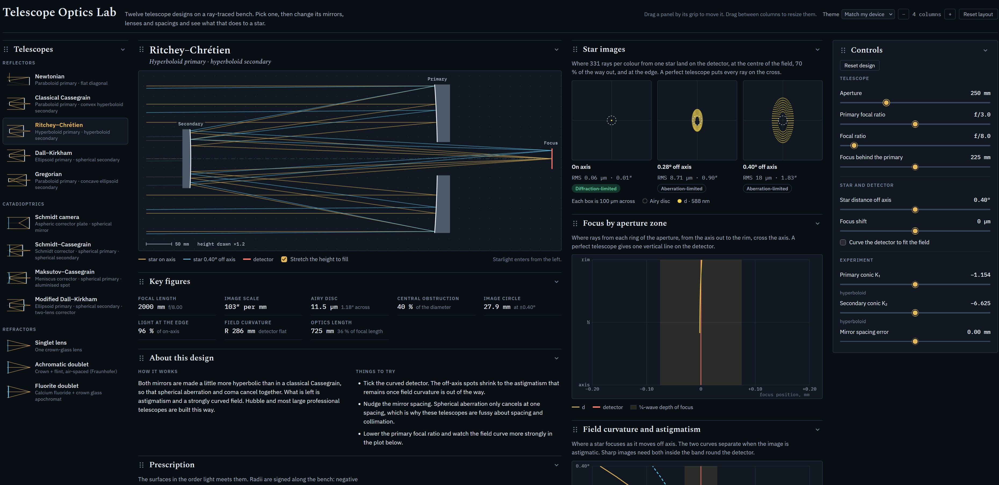

# Telescope Optics Lab

An interactive, ray-traced bench for comparing telescope designs. Pick a design, change its mirrors, lenses and spacings, and see what that does to a star image.

Everything runs in the browser from a single HTML file. Every diagram and number comes from tracing rays through the actual optical surfaces; nothing is a stored picture.

## Running it

Open `index.html` in a current browser. There is no build step and nothing to install.

The page loads three typefaces from Google Fonts. Without a network connection it falls back to system fonts and works the same.

- **Live demo:** https://jurgenkobierczynski.com/Telescope-Optics-Lab/Telescope_Optics_Lab.html

## Screenshot

## Designs

| Group | Design | Made of |
| --- | --- | --- |
| Reflectors | Newtonian | Paraboloid primary, flat diagonal |
| | Classical Cassegrain | Paraboloid primary, convex hyperboloid secondary |
| | Ritchey–Chrétien | Hyperboloid primary, hyperboloid secondary |
| | Dall–Kirkham | Ellipsoid primary, spherical secondary |
| | Gregorian | Paraboloid primary, concave ellipsoid secondary |
| Catadioptrics | Schmidt camera | Aspheric corrector plate, spherical mirror |
| | Schmidt–Cassegrain | Schmidt corrector, spherical primary and secondary |
| | Maksutov–Cassegrain | Meniscus corrector, spherical primary, aluminised spot (f/15) |
| | Modified Dall–Kirkham | Ellipsoid primary, spherical secondary, two-lens corrector (f/6.8) |
| Refractors | Singlet lens | One N-BK7 lens with adjustable shape |
| | Achromatic doublet | N-BK7 + F2, air-spaced Fraunhofer |
| | Fluorite doublet | CaF₂ + N-BAK4 |

## What you see

- **Ray diagram.** The optical layout drawn from traced rays, for a star on axis and a star off axis.
- **Key figures.** Focal length, image scale, Airy disc, central obstruction, image circle, edge illumination, field curvature and optics length.
- **Star images.** Spot diagrams at the centre of the field, 70 % of the way out and at the edge, with the Airy disc for scale and the RMS radius in microns and arcseconds.
- **Focus by aperture zone.** Longitudinal aberration for each colour, with the quarter-wave depth of focus as a band.
- **Field curvature and astigmatism.** Tangential and sagittal focus across the field, against the detector.
- **Prescription.** Every surface in the order light meets it: radius, conic or aspheric terms, spacing, medium and clear diameter.
- **About this design.** How the design works and a few experiments to try.

## What you can change

- Aperture, focal ratios and back focus, for the designs that are solved from them.
- Star distance off axis, focus shift, and a detector curved to fit the field.
- Starlight: one colour (588 nm), three (F, d, C) or four (adds the violet g line), for designs that contain glass.
- Experiments: mirror conic constants, mirror spacing error, corrector strength, lens shape, re-figuring the Schmidt corrector for altered mirrors, and taking out the Modified Dall–Kirkham's corrector lenses.

## Layout and themes

- Drag a panel by the grip beside its title to move it within a column or to another column. With the grip focused, the arrow keys do the same.
- Drag the gap between two columns to resize them. The − and + buttons in the header remove or add a column.
- The chevron on each panel hides or shows it. **Reset layout** restores the default arrangement.
- The **Theme** menu offers Drafting paper, Observatory, Blueprint, Red night vision and High contrast, or follows the device's light or dark setting.

The chosen design, layout and theme are kept in the browser's local storage (`tol-design`, `tol-layout`, `tol-theme`). Nothing is sent anywhere.

## How the optics are computed

- A sequential 3D ray tracer handles conic surfaces with even aspheric terms up to r⁶, mirrors, refraction, a tilted fold mirror, central obstructions and holes. Units are millimetres.
- Glass dispersion uses Sellmeier equations: Schott catalogue coefficients for N-BK7, F2 and N-BAK4, and Malitson's coefficients for calcium fluoride.
- Two-mirror designs use the closed-form conic constants for each type.
- The Schmidt corrector's aspheric terms and the doublets' four radii are solved in the page by least squares each time the telescope's parameters change. The doublets are solved for focal length, F–C colour, spherical aberration and coma.
- Mirrors, lenses and holes are sized so that the chosen field passes.
- Best focus is the plane of smallest RMS spot on axis at 588 nm. Field curvature is taken from the mean of the tangential and sagittal foci.

### Checks made

- Refractive index and Abbe number of each glass reproduce the catalogue values.
- The Ritchey–Chrétien traces coma-free, and the classical Cassegrain shows the coma of a paraboloid of the same focal ratio.
- The Schmidt camera's focal surface comes out with a radius equal to its focal length.
- The solved achromat matches the textbook Fraunhofer shape.
- A randomised sweep of 1,800 parameter sets across all designs ran without errors.

### Limits

- Spots are geometric. Diffraction appears only as the Airy circle, and "diffraction-limited" means the RMS spot radius is smaller than the Airy radius, which is a rule of thumb.
- The Maksutov–Cassegrain and Modified Dall–Kirkham prescriptions were optimised for this lab. They are not any manufacturer's design, their focal ratios are fixed, and they scale with aperture only.
- The all-spherical Maksutov keeps some zonal spherical aberration and off-axis coma.
- No tolerancing, tilt or decentre, thermal effects, coatings or baffle design.

## Files

| File | Purpose |
| --- | --- |
| `index.html` | The whole lab: markup, styles and scripts in one file |
| `README.md` | This document |
| `LICENSE` | GNU General Public License, version 3 |

Inside `index.html` the script is in four parts: the ray tracer (`OPT`), the telescope prescriptions and analysis (`LAB`), the panel board (`BOARD`), and the page logic.

## Licence

Copyright (C) 2026 Jurgen Kobierczynski

This program is free software: you can redistribute it and/or modify it under the terms of the GNU General Public License as published by the Free Software Foundation, version 3 (SPDX: `GPL-3.0-only`).

This program is distributed in the hope that it will be useful, but WITHOUT ANY WARRANTY; without even the implied warranty of MERCHANTABILITY or FITNESS FOR A PARTICULAR PURPOSE. See the GNU General Public License in `LICENSE` for details.

The typefaces (IBM Plex Sans, IBM Plex Mono and Spectral) are loaded from Google Fonts under the SIL Open Font License and are not part of this repository.

## Attribution

Built with Claude Opus 5.5 Medium.
